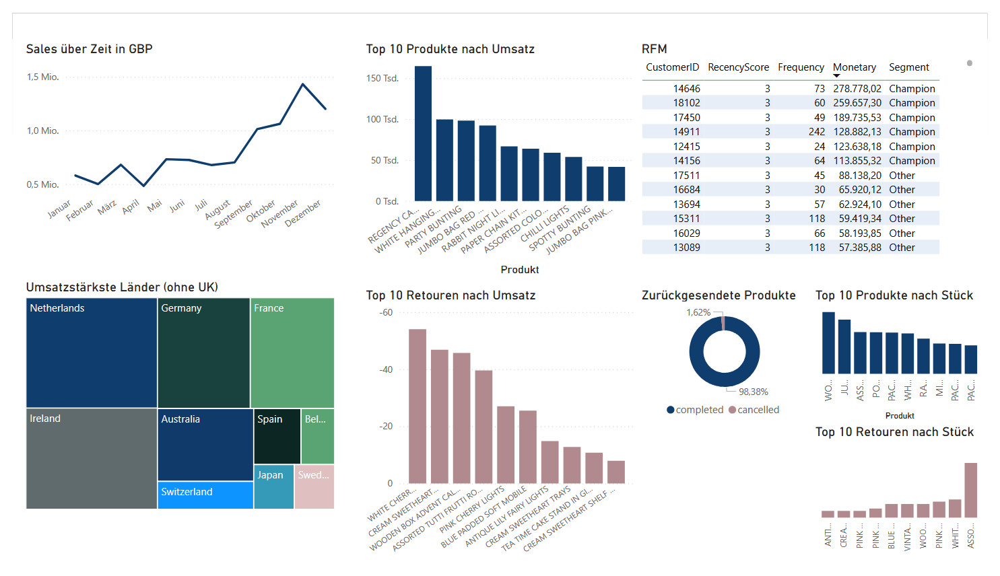

# E-Commerce Sales Dashboard

## Ziel
Analyse von Verkaufsdaten eines Online-Shops. Ziel ist es, Einblicke in Umsatzentwicklung, Produktperformance, Geografie und Kundenverhalten zu gewinnen.

## Fragestellungen
- Wie entwickeln sich die Umsätze über die Zeit?
- Welche Produkte verkaufen sich am besten (oder am schlechtesten)?
- Woher kommen die meisten Umsätze geografisch?
- Wie unterscheiden sich Kundengruppen (RFM)?

## Tools
- Python (pandas, numpy, matplotlib)
- GitHub

## Insights/weitere Fragen
- Starker Umsatzanstieg ab August. Wie ist der zu erklären?
- Retourenrate insgesamt sehr niedrig (1,62%)
- Neben dem heimischen Markt (UK), Niederlande, Irland, Deutschland und Frankreich am umsatzstärksten
- 6 Champions (0,1%) machen x% des Umsatzes aus. Können diese mit Exklusiven Kampagnen weiter gefördert werden (z.B. Treueprogramm, Early Access)?
- Wie kann das Kundensegment "Other" sinnvoll genutzt und gefördert werden?

## Produktperformance
### 10 Produkte mit stärkstem Umsatz

  

### 10 Produkte mit schwächstem Umsatz.
Negativer Umsatz bedeutet hier die meisten Retouren  

## Dashboard
